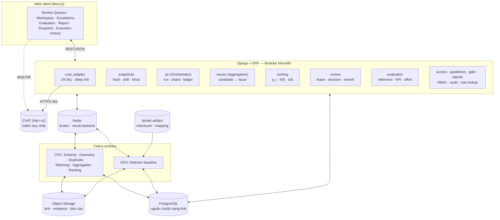

# Sơ đồ thành phần

Sơ đồ dựa trên SRS `fig:components` ([10-architecture.tex](../../label-x_system-requirement-specification/sections/10-architecture.tex)) và nguồn L (`docs/00-project/sources/mermaid-diagram.png`). Một số khối của L đã được lược bỏ hoặc hoãn theo quyết định chốt:

- **Guideline / RAG** và **Vector Index** bị thay bằng tra cứu trực tiếp rule (B-13).
- **Classifier** không bật (B-07).
- **VLM Verification** đề xuất không bật trong pilot (TBD-08).
- **Release Management** nằm ngoài phạm vi M13 (FR-GTE-04).

Ranh giới: worker AI (Detector) chỉ ghi Candidate và Evidence. Không có đường gọi nào từ worker tới quyết định, gate hay phân xử (A ADR-07; R-02).

Xem thêm: [system-design.md](../system-design.md), [deployment.md](deployment.md), [data-flow.md](data-flow.md).
