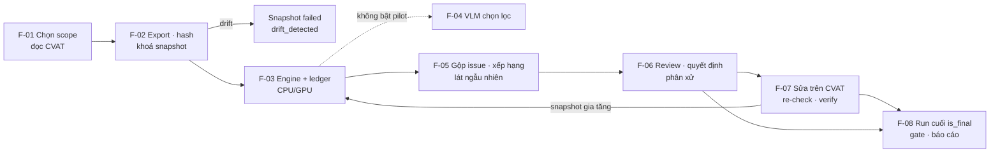
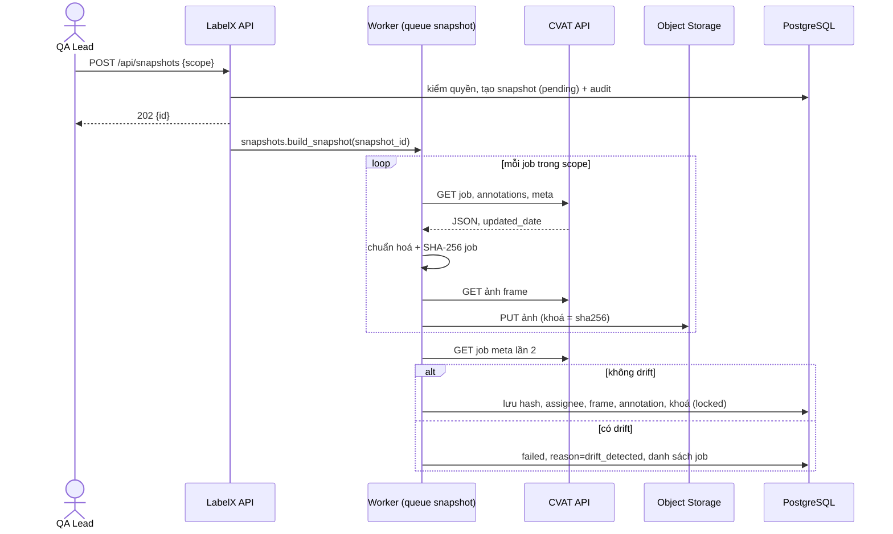
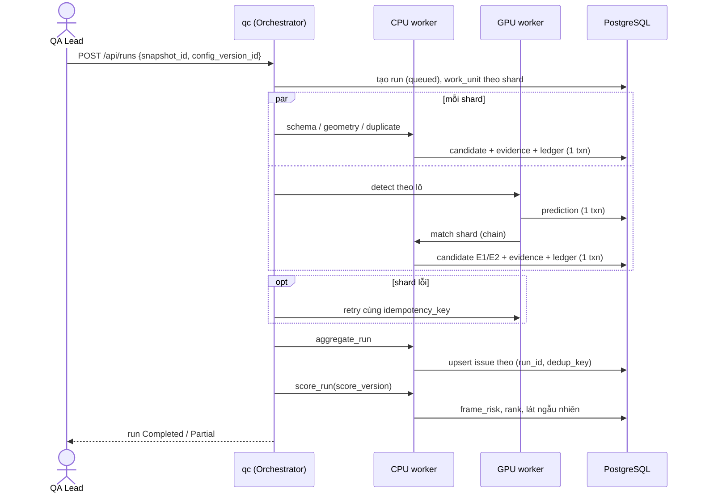
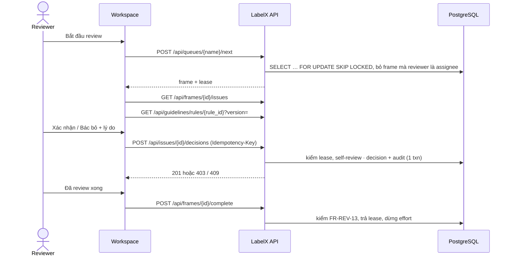
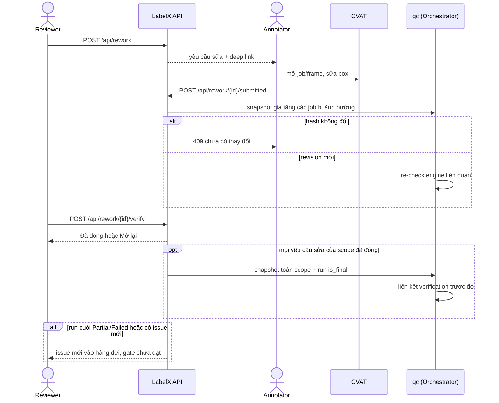

# Sơ đồ luồng dữ liệu

Các sơ đồ dưới đây chuyển SD-1…SD-4 trong SRS §5.2 ([05-dynamics.tex](../../label-x_system-requirement-specification/sections/05-dynamics.tex)) sang Mermaid. Mã F-xx theo nguồn R mục 5.

## Tổng quan F-01 → F-08

## SD-1 — Tạo snapshot (F-01, F-02)

## SD-2 — QC Run (F-03, F-05)

## SD-3 — Review (F-06)

## SD-4 — Rework và run cuối (F-07, F-08)

