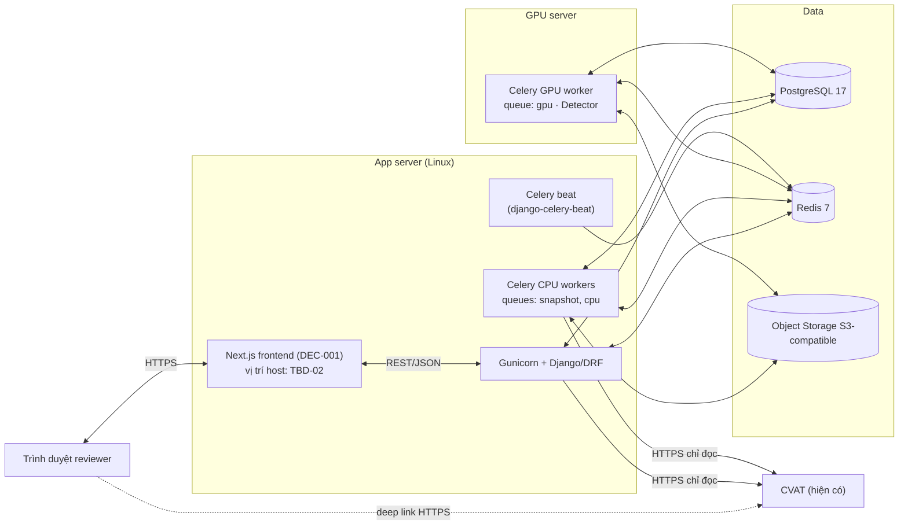
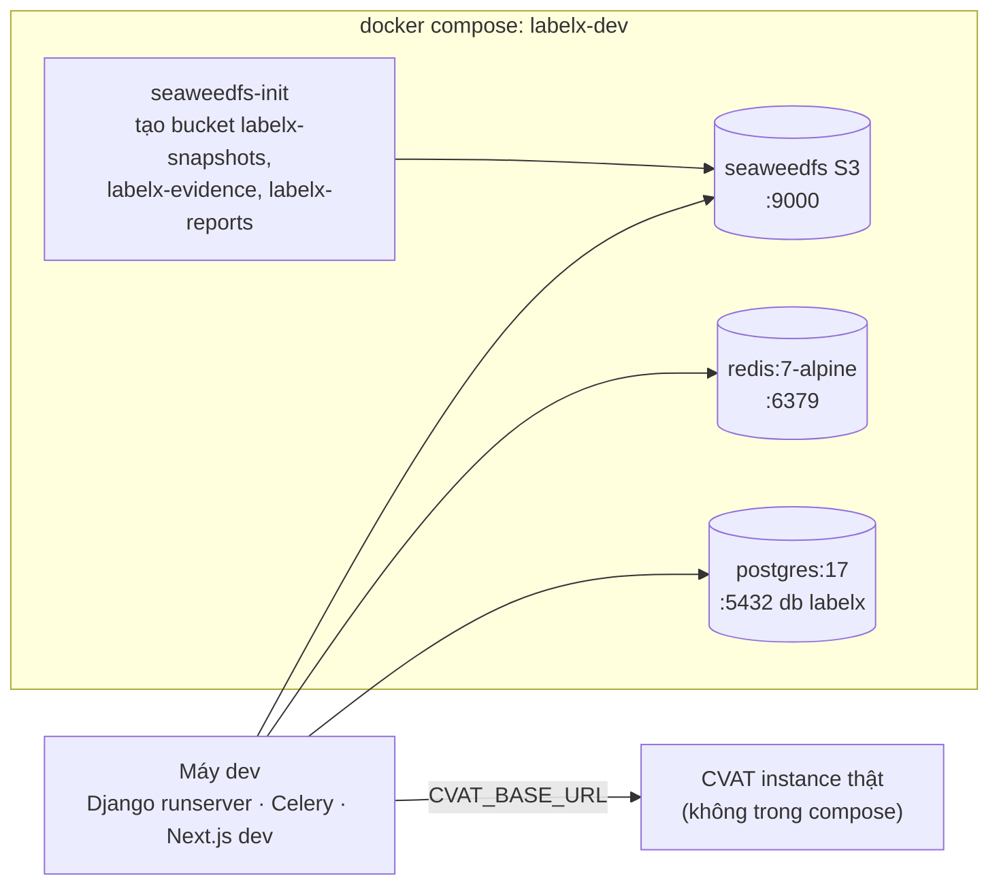

# Sơ đồ triển khai

## Môi trường thật

Nguồn: SRS `fig:deployment`. Cấu hình phần cứng của app server và GPU server là **TBD-02**. RPO/RTO là **TBD-17**.

Ràng buộc:

- Token CVAT chỉ nằm ở app server và worker, không bao giờ gửi xuống trình duyệt (FR-SNP-02; NFR-07).
- Ảnh chỉ nằm trong Object Storage nội bộ. Detector chạy trên GPU nội bộ (NFR-09).
- Frontend Next.js (DEC-001) không có trong sơ đồ triển khai của SRS. Việc chạy nó trên app server hay host riêng là **TBD-02**. Nếu trình duyệt gọi thẳng API thì cần cấu hình CORS và cookie session (`CORS_ALLOWED_ORIGINS`, `CORS_ALLOW_CREDENTIALS` trong settings).
- Không cần GPU worker thứ hai cho VLM, vì VLM không bật trong pilot (TBD-08).

## Dev local

Nguồn: [docker-compose.dev.yml](../../../infrastructure/docker-compose.dev.yml).

