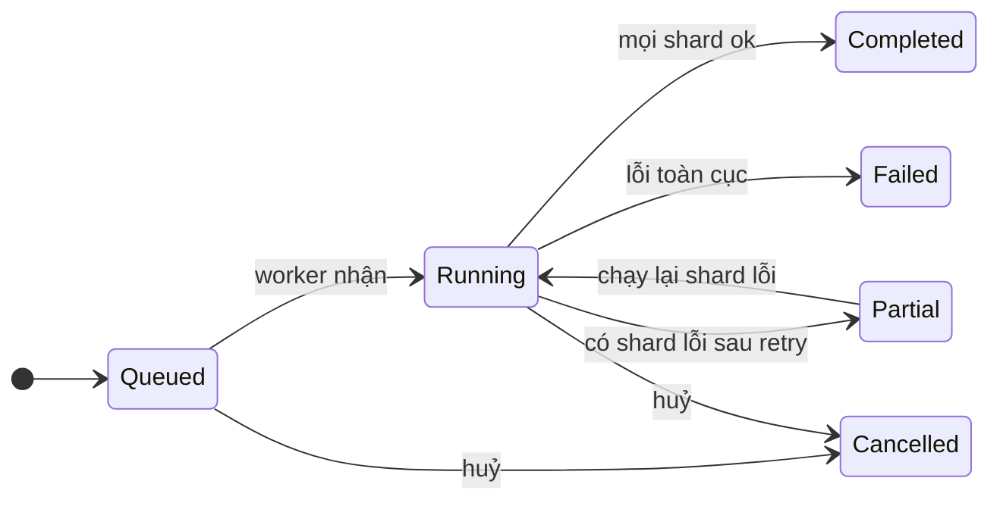
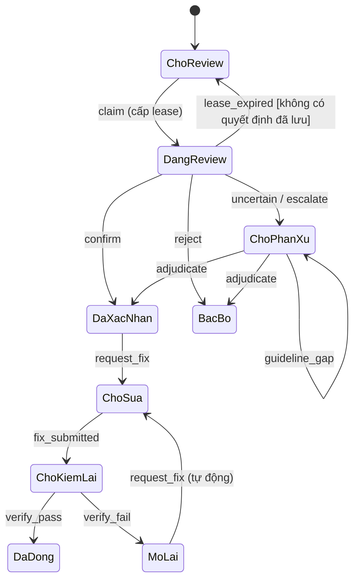

# Thiết kế hệ thống LabelX Quality Control

## 1. Bối cảnh và phạm vi

LabelX là module Quality Control (QC) chạy cạnh CVAT. CVAT là hệ thống nguồn của annotation và là **editor duy nhất**. LabelX chỉ đọc cấu trúc Project/Task/Job/Frame, annotation và ảnh. Mọi thao tác tạo, sửa hay xoá annotation đều làm trên CVAT, thông qua deep link (nguồn: H `Main.dc.html`; R B-18; SRS FR-SNP-01).

Bản nghiệm thu đầu tiên là lát cắt **M13 — Reviewer Prioritization Assistant**. Luồng của nó như sau: annotation từ CVAT → phân tích nghi vấn → xếp hạng frame → reviewer xem bằng chứng và phân xử → báo cáo hiệu quả. Phạm vi dữ liệu là ảnh BDD100K, Bounding box, 10 lớp, và ba nhóm lỗi E1 (thiếu box), E2 (sai lớp), E3 (trùng box) (nguồn: SRS [01-introduction.tex](../label-x_system-requirement-specification/sections/01-introduction.tex), [03-data-errors.tex](../label-x_system-requirement-specification/sections/03-data-errors.tex)).

Các mục **ngoài phạm vi MVP**: temporal/track (B-09), Diff/pre-label (B-16), Classifier (B-07), Guideline RAG (B-13), annotation writeback (B-18), phát hành dataset đầy đủ (FR-GTE-04). Engine VLM đề xuất không bật trong pilot (TBD-08). Xem bảng loại trừ trong [decisions.md](decisions.md).

### Actor

| Actor | Vai trò chính | Nguồn |
|---|---|---|
| Annotator | Sửa trên CVAT, báo "Đã sửa" | SRS `tab:rbac` |
| Reviewer | Review theo hàng đợi, ra quyết định, yêu cầu sửa, verify | SRS `tab:rbac` |
| QA Lead | Chạy snapshot/run, phân xử, quản lý và khoá reference, duyệt waiver | SRS `tab:rbac`; R "Phân công" |
| QC Admin | Cấu hình engine, mapping, quyền | SRS `tab:rbac` |
| Super Admin | Ghi đè có lý do và audit, vẫn chịu ràng buộc self-review | FR-SEC-06 |
| Hệ thống (worker) | Export, chạy engine, gộp issue, xếp hạng, re-check | SRS §5 |

## 2. Thành phần

Sơ đồ chi tiết: [diagrams/component.md](diagrams/component.md).

| Thành phần | Công nghệ | Trách nhiệm | Nguồn |
|---|---|---|---|
| Web client | Next.js + React + TypeScript | Review Queues, Workspace, Escalations, Evaluation, Report; gọi REST/JSON | DEC-001; SRS ch.10 |
| API | Django + DRF (Gunicorn) | REST, xác thực theo session, kiểm quyền, ghi transaction | DEC-001; [settings.py](../../src/backend/config/settings.py) |
| CPU worker | Celery | Snapshot export, Schema, Geometry, Duplicate, Matching, Aggregation, Ranking, Evaluation | SRS ch.10 |
| GPU worker | Celery | Detector baseline (suy luận theo lô) | SRS ch.10; FR-ENG-05 |
| Broker | Redis 7 | Broker và result backend của Celery (`CELERY_BROKER_URL`, `CELERY_RESULT_BACKEND`). SRS cho phép dùng Redis làm cache, nhưng `settings.py` **hiện chưa cấu hình `CACHES`**. **Không** là nguồn chuẩn của lease | SRS `tab:modules`; settings |
| CSDL | PostgreSQL 17 | Snapshot, run, ledger, candidate, issue, lease, decision, audit, effort, reference | SRS ch.10 |
| Object Storage | S3-compatible | Ảnh, crop evidence, báo cáo xuất | [object-storage.md](../11-integrations/object-storage.md) |
| Model artifact | File trên Object Storage hoặc ổ của GPU server | Trọng số Detector, kèm checksum và mapping lớp | SRS ch.10; L "Model Registry" |
| CVAT | Hệ thống ngoài | Nguồn annotation và ảnh; editor | [cvat.md](../11-integrations/cvat.md) |

## 3. Module backend (Django apps)

Mỗi module là một Django app có bảng riêng, để có thể tách ra sau này (A ADR-01). Các module chỉ gọi nhau qua service function Python, không truy cập thẳng bảng của module khác. Tên app dưới đây là **đề xuất đặt tên**. `INSTALLED_APPS` hiện chưa có app LabelX nào; app sẽ được thêm khi epic tương ứng được triển khai.

| App | Module SRS | Trách nhiệm | Yêu cầu |
|---|---|---|---|
| `access` | Auth/RBAC/Audit | Vai trò theo scope dataset, identity mapping LabelX ↔ CVAT, audit append-only | FR-SEC-01…07 |
| `cvat_adapter` | CVAT Adapter | Client chỉ đọc, chuẩn hoá annotation, sinh deep link | FR-SNP-01, 02, 08 |
| `snapshots` | Snapshot | Hash, kiểm drift, khoá, lineage `parent_snapshot` | FR-SNP-03…09 |
| `qc` | QC Orchestrator | Run, chia shard, phụ thuộc giữa các bước, retry, huỷ, ledger | FR-ENG-01, FR-AGG-02, 04–06 |
| `engines` | Engine | Schema/Taxonomy, Geometry, Duplicate/Overlap, Detector, Matching; dùng interface chung | FR-ENG-02…10; NFR-13 |
| `issues` | Aggregation | Candidate → Issue theo `dedup_key`, neo và `n_i` | FR-AGG-01, 03; FR-RNK-12 |
| `ranking` | Ranking | `q_i`, `h(f)`, `s(f)`, phá hoà, lát ngẫu nhiên, ranking đối chứng | FR-RNK-01…11 |
| `review` | Review Workflow | Hàng đợi, lease, quyết định, phân xử, rework, verify | FR-REV, FR-ESC, FR-RWK |
| `guidelines` | Guideline | Guideline version, rule, mapping, Decision Case, Guideline Gap | FR-GDL-01…04 |
| `evaluation` | Evaluation | Reference, suy ra tập lỗi, Recall@k, effort, non-inferiority, Metric engine. **Model Orchestrator** tổng hợp kết quả đánh giá engine trên reference đã khoá, kèm provenance (engine/model/config version, snapshot, reference version, scope, định nghĩa metric, cỡ mẫu); không dùng model làm trọng tài. Đặc tả chi tiết: **TBD-21** | FR-EVL-01…16; B-05; SRS `tab:modules` |
| `gate` | Quality Gate | Điều kiện gate, waiver | FR-GTE-01…04 |
| `reports` | Report | Báo cáo hiệu quả, xuất PDF/CSV/JSON | FR-RPT-01…06 |

### Interface engine

Interface lấy từ A §20.3, đã chỉnh theo SRS:

```text
EngineJob    { run_id, engine, engine_version, config_version, model_checksum?, snapshot_id,
               shard: { cvat_job_id, frame_from, frame_to }, attempt }
EngineOutput { status: Checked | Partial | Failed | Not checked,
               reason?: disabled | no_model | no_reference | not_applicable | not_triggered,
               ledger: [{ unit_ref, applicability, status, reason? }],
               candidates: [Candidate], evidence: [Evidence], duration_ms, error? }
```

A dùng thêm `ISSUE_FOUND`; H hiển thị "Issue found". Theo FR-AGG-05, trạng thái lưu trữ chỉ có năm giá trị: Checked, Partial, Failed, Not checked, Running. Nhãn "Issue found" của H được coi là **hiển thị phái sinh** của Checked khi có candidate. Cách hiển thị này cần UI xác nhận (xem mục 10).

## 4. Worker và hàng đợi

| Queue (tên đề xuất) | Worker | Task | Ghi chú |
|---|---|---|---|
| `snapshot` | CPU, nặng I/O | Export job từ CVAT, upload ảnh, verify và khoá | Timeout đọc CVAT đặt riêng (R "Cấu hình vận hành"; TBD-13) |
| `cpu` | CPU | Schema, Geometry, Duplicate, Matching, Aggregation, Ranking, Evaluation, xuất báo cáo | Chạy song song theo shard |
| `gpu` | GPU server | Detector theo lô | Ảnh không gửi ra ngoài (NFR-09) |
| `vlm` | — | Kiểm chọn lọc VLM | **Không bật** trong pilot (TBD-08). Không khởi động worker cho queue này |

Cấu hình Celery đã có trong settings: `task_acks_late=True`, `task_reject_on_worker_lost=True`, `worker_prefetch_multiplier=1`. Như vậy một task có thể chạy lại khi worker chết, nên **mọi task phải idempotent**. Lịch định kỳ dùng `django_celery_beat` (DatabaseScheduler). Danh sách task chi tiết: [event-contracts.md](../04-api/event-contracts.md).

## 5. Luồng F-01…F-08

Mã F-01…F-08 là luồng tham chiếu trong R mục 5, đã được SRS `tab:flowsteps` cụ thể hoá. Sơ đồ chi tiết: [diagrams/data-flow.md](diagrams/data-flow.md).

| Bước | Công việc | Actor | Thành phần | Điểm kiểm soát | Nguồn |
|---|---|---|---|---|---|
| F-01 | Chọn phạm vi, đọc CVAT | QA Lead (chạy), QC Admin (cấu hình) | `cvat_adapter` | Chỉ đọc; token ở backend | B-18; FR-SNP-01, 02 |
| F-02 | Export, hash, khoá snapshot | Hệ thống | `snapshots`, queue `snapshot` | Có drift thì không khoá | B-02; FR-SNP-03…06; SD-1 |
| F-03 | Chạy engine, ghi ledger | Worker | `qc`, `engines`, queue `cpu`/`gpu` | Retry idempotent; Not checked/Partial/Failed không bao giờ là đạt | B-10, B-19; SD-2 |
| F-04 | Kiểm chọn lọc VLM | Worker | — | Không bật trong pilot M13 | B-08; FR-ENG-10; TBD-08 |
| F-05 | Gộp issue, xếp hạng, tạo lát ngẫu nhiên | Hệ thống | `issues`, `ranking` | Công thức có version; lát ngẫu nhiên độc lập với ranking | FR-AGG-03; FR-RNK-01…07 |
| F-06 | Review, quyết định, phân xử | Reviewer, QA Lead | `review`, `guidelines` | Lease; chặn self-review; audit cùng transaction | B-12; FR-REV; SD-3 |
| F-07 | Sửa trên CVAT, re-check, verify | Annotator, worker, Reviewer | `review`, `snapshots`, `qc` | Issue chỉ đóng sau khi verify trên revision đã sửa | B-03; FR-RWK-01…05; SD-4 |
| F-08 | QC run cuối, gate, báo cáo | Hệ thống, QA Lead | `qc`, `gate`, `reports` | Báo cáo và gate trỏ run cuối | B-03, B-15; FR-RWK-06, 08; FR-GTE |

Đánh giá KPI (UC-08…UC-10, SD-5) là nhánh song song. QA Lead khoá reference, sau đó `evaluation` đọc ranking, tập lỗi và effort log để tính Recall@k, KPI-2 và non-inferiority. Nhánh này phải gặp luồng chính trước khi kết luận nghiệm thu (R mục 7, "đường găng").

### Máy trạng thái

Nguồn: SRS §5.3–5.5. Chuyển trạng thái không có trong bảng sẽ trả 409.





Bảng ánh xạ mã trạng thái: `ChoReview`=`pending_review` (Chờ review), `DangReview`=`in_review`, `DaXacNhan`=`confirmed`, `BacBo`=`rejected`, `ChoPhanXu`=`awaiting_adjudication`, `ChoSua`=`fix_requested`, `ChoKiemLai`=`awaiting_verification`, `DaDong`=`closed`, `MoLai`=`reopened`. Mã tiếng Anh là đề xuất cho cột `issue.state`. Nhãn hiển thị giữ theo H.

Snapshot có các trạng thái `pending` → `exporting` → `locked`, hoặc `failed` với lý do `drift_detected`/`export_error` (SD-1). Trạng thái review của frame gồm: Chưa review → Đang review (có lease) → Đã review → Còn issue chờ (phân xử hoặc sửa) → Hoàn tất (run cuối) (SRS `fig:framestate`).

## 6. Idempotency và retry

| Cơ chế | Quy tắc | Nguồn |
|---|---|---|
| Khoá đơn vị xử lý | `idempotency_key = sha256(snapshot_id, engine, engine_version, config_version, model_checksum, shard_key)`, có UNIQUE `(run_id, idempotency_key)` trong bảng `work_unit` | FR-AGG-02; T §6 |
| Ghi kết quả shard | Candidate, evidence và cập nhật ledger trong **một** transaction. Đơn vị đã ở trạng thái `completed` thì task kết thúc ngay (no-op) | FR-AGG-06 |
| Candidate | Có `candidate_fingerprint` UNIQUE theo run; dùng `INSERT … ON CONFLICT DO NOTHING`. Không bao giờ UPDATE | FR-AGG-01 |
| Issue | UNIQUE `(run_id, dedup_key)`; upsert để gắn thêm candidate, không tạo issue mới | FR-AGG-03; BR-08 |
| Blob | Upload lên Object Storage **trước**, với khoá theo hash nội dung. Ghi lại cùng khoá là idempotent. Sau đó mới commit metadata | NFR-06 |
| Quyết định review | Header `Idempotency-Key` được lưu với UNIQUE trên `review_decision`. Gửi lại cùng khoá trả lại kết quả cũ | A §25.1 (đề xuất, xem [rest-api.md](../04-api/rest-api.md)) |
| Enqueue | Commit chuyển trạng thái trước, rồi enqueue qua `transaction.on_commit`. Task claim bằng cập nhật có điều kiện, nên chạy lại được từ trạng thái trung gian. Chọn sweeper hay outbox **cần decision mới** ([event-contracts.md](../04-api/event-contracts.md) mục 1) | Yêu cầu thiết kế |
| Retry | Số lần thử và backoff: TBD-14. Hết lượt thì đơn vị là `failed`, run là Partial; không làm hỏng run | NFR-05 |
| VLM (nếu bật) | Tối đa 3 lần thử, đã gồm retry; budget 400 candidate | B-08 |
| Huỷ | `POST /runs/{id}/cancel` đặt `cancel_requested_at`. Task kiểm cờ này trước khi nhận đơn vị mới. Kết quả đã commit được giữ lại. Run chuyển Cancelled | SRS state machine QC Run; R "Huỷ chạy" |

## 7. Snapshot và revision

- CVAT không có "annotation revision" chính thức. Revision trong LabelX là **hash do LabelX tính** từ JSON đã chuẩn hoá: sắp xếp khoá, toạ độ làm tròn cố định (số chữ số: **TBD-20**), SHA-256 theo job, sau đó tính hash tổng (nguồn: A §21; FR-SNP-03).
- Kiểm drift: đọc `updated_date` của từng job lúc bắt đầu, rồi đọc lại trước khi khoá. Nếu khác thì snapshot `failed` (`drift_detected`) và trả về danh sách job bị drift (FR-SNP-04; SD-1).
- Snapshot đã khoá là bất biến. Mọi thay đổi annotation tạo snapshot mới có `parent_snapshot_id` (FR-SNP-06).
- Snapshot lưu assignee của từng job tại thời điểm snapshot. Đây là căn cứ chặn self-review (FR-SNP-05; B-12).
- Rework: khi annotator bấm "Đã sửa", hệ thống tạo snapshot gia tăng cho job bị ảnh hưởng. Nếu hash không đổi thì trả 409 "chưa có thay đổi" (FR-RWK-03, FR-SNP-09).
- Run cuối: khi mọi yêu cầu sửa trong phạm vi đã đóng, hệ thống tạo snapshot toàn phạm vi và QC Run có `is_final=true`, liên kết các verification trước đó (FR-RWK-06).

## 8. Coverage ledger

- Ledger ghi theo **từng engine** và từng đơn vị áp dụng. Mỗi đơn vị có trạng thái `eligible`, `completed`, `failed` hoặc `not_checked`, kèm lý do (FR-AGG-04).
- Đơn vị áp dụng theo policy MVP: Schema/Geometry theo annotation; Duplicate/Overlap theo frame (cặp so được); Detector và Matching theo frame; Metric theo scope reference; VLM (nếu bật) theo candidate được trigger (R "Required units").
- `coverage(engine) = completed / eligible`. Mẫu số **gồm cả** đơn vị lỗi. Đơn vị `not_triggered` không nằm trong mẫu số của kiểm chọn lọc (SRS `tab:enginestates`).
- Frame có engine bắt buộc ở trạng thái Not checked hoặc Failed mang cờ `missing_evidence` trong hàng đợi (FR-RNK-06).
- Gate coverage là ≥ 95% trên từng engine bắt buộc, tính trên run cuối (FR-GTE-01). Truy vấn xem tại [queries.md](../05-database/queries.md).

## 9. Triển khai

Sơ đồ: [diagrams/deployment.md](diagrams/deployment.md).

- **Dev local**: [docker-compose.dev.yml](../../infrastructure/docker-compose.dev.yml) chạy `postgres:17`, `redis:7-alpine`, `seaweedfs` (S3 ở cổng 9000) và `seaweedfs-init`. `seaweedfs-init` tạo các bucket `labelx-snapshots`, `labelx-evidence`, `labelx-reports`. CVAT không nằm trong compose.
- **Môi trường thật** (SRS `fig:deployment`): một app server Linux chạy Gunicorn + Django/DRF và Celery CPU worker; một GPU server chạy Celery GPU worker; tầng dữ liệu gồm PostgreSQL, Redis và Object Storage hiện có; CVAT hiện có được truy cập qua HTTPS (chỉ đọc). Cấu hình phần cứng: **TBD-02**.
- Sao lưu PostgreSQL và Object Storage (bật versioning) theo cùng lịch; RPO/RTO: **TBD-17** (NFR-16).
- Quan sát: log có cấu trúc kèm `run_id`, `snapshot_id`, `request_id`; metric hàng đợi Celery (NFR-12).

## 10. Mâu thuẫn nguồn và cách xử lý

| Điểm | Nguồn mâu thuẫn | Xử lý |
|---|---|---|
| Backend | A FastAPI; L và R Django | Django (DEC-001) |
| Lease | A: lease theo issue, 15 phút, heartbeat; SRS: lease theo frame, thời hạn TBD-09 | Theo SRS (FR-REV-03, 04). Không dùng giá trị 15 phút |
| Nguồn chuẩn lease | A: Redis làm lease cache | PostgreSQL là nguồn chuẩn (SRS `tab:modules`) |
| Khoá idempotent | A `(runId, engine, shard)`; T `snapshot+step+frame+config/model` | SRS FR-AGG-02 `(snapshot, engine, config, model, shard)` |
| Trạng thái engine | T NOT_REQUIRED; A ISSUE_FOUND; H "Issue found" | SRS FR-AGG-05: năm trạng thái công khai. "Issue found" chỉ là nhãn hiển thị phái sinh, cần xác nhận khi build UI |
| Trạng thái Issue/Run | A và T có tập trạng thái riêng | Theo SRS §5 (dựa trên H) |
| Drift | A: webhook `update:job`; R: polling có checkpoint nếu webhook không có | Theo SRS FR-SNP-04: đọc lại trước khi khoá. Webhook là tuỳ chọn, phụ thuộc TBD-01 |
| Đường dẫn API | A `/api/qc/v1/...`; SRS `/api/...` | Theo SRS §9.3 |
| Phạm vi | R nói chung về QC; SRS khoá M13 (BDD100K, 10 lớp) | Theo SRS cho MVP; schema không gắn cứng 10 lớp (mapping lớp có version) |

## 11. TBD liên quan

TBD-01 (CVAT), TBD-02 (phần cứng), TBD-05 (`τ_m`, `τ_amb`), TBD-08 (VLM), TBD-09 (lease), TBD-10 (tỉ lệ lát ngẫu nhiên), TBD-13 (hiệu năng), TBD-14 (retry/backoff), TBD-15 (lưu audit), TBD-17 (RPO/RTO), TBD-18 (giấy phép BDD100K, trước khi nạp dữ liệu vào Object Storage), TBD-19 (điều kiện gate được waiver), TBD-20 (timeout mỗi lượt VLM, `t_gc`, ε của `score_v0`, số chữ số làm tròn toạ độ khi hash), TBD-21 (đặc tả Model Orchestrator). Định nghĩa đầy đủ ở bảng `tab:tbd` trong [11-traceability.tex](../label-x_system-requirement-specification/sections/11-traceability.tex).
